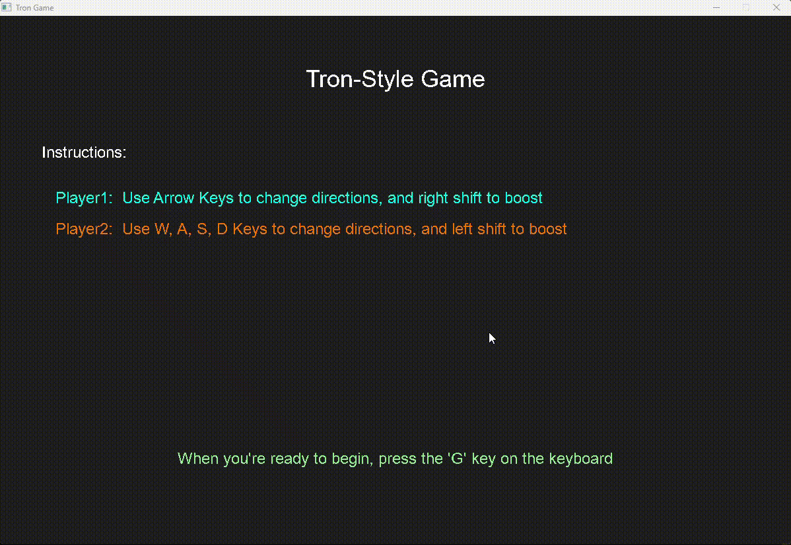

# CPPND: Capstone Tron Game

This Capstone project is based on the snake game starter code. It's my take on a game from the Tron universe. The players compete against each other, trying to make the other crash into the light trails created while navigating the map. The players are able to use 6 boosts each (number of remaining boosts is on the top bar of the game window) per round to try and out maneuver their opponets.

I built this in Windows, and I'm not sure if it will work in a Linux environment. I had a very difficult time getting SDL2_ttf working in my CMakeLists, but we eventually got there. I'll include the libs/ directory which contains SDL2 and SDL2_ttf so it'll maybe work right out the box.

## Dependencies for Running Locally
* VSCode for running cmake:
  * CMake Tools extension by Microsoft (I'm running v1.15.31)
  * C/C++ extention by Microsoft (I'm running 1.17.5)
* cmake >= 3.7
  * All OSes: [click here for installation instructions](https://cmake.org/install/)
* make >= 4.1 (Linux, Mac), 3.81 (Windows)
  * Linux: make is installed by default on most Linux distros
  * Mac: [install Xcode command line tools to get make](https://developer.apple.com/xcode/features/)
  * Windows: [Click here for installation instructions](http://gnuwin32.sourceforge.net/packages/make.htm)
* SDL2 >= 2.0
  * All installation instructions can be found [here](https://wiki.libsdl.org/Installation)
  >Note that for Linux, an `apt` or `apt-get` installation is preferred to building from source.
* SDL2_ttf >= 2.0
  * All installation instructions can be found [here](https://github.com/libsdl-org/SDL_ttf/releases)
* gcc/g++ >= 5.4
  * Linux: gcc / g++ is installed by default on most Linux distros
  * Mac: same deal as make - [install Xcode command line tools](https://developer.apple.com/xcode/features/)
  * Windows: recommend using [MinGW](http://www.mingw.org/) 

## Basic Build Instructions

1. Clone this repo.
2. Make a build directory in the top level directory: `mkdir build && cd build`
3. Copy the files from resources/* into the build directory
4. Update CMakeLists.txt to point to your installation of SDL2 and SDL2_ttf
3. In VSCode open command palette and run `CMake: Configure`
    * I used [this](https://www.youtube.com/watch?v=gGxi500Q5uE&t=177s&ab_channel=Code%2CTech%2CandTutorials) youtube video to help with compiling
4. In the build directory, run `make`
5. Run `./TronGame` to start the program
    * Note: In my environment the SDL2.dll and SDL2_ttf.dll files are needed in the run directory for the program to start. This should be take care of in step 3
